## Unit 19 Homework: Protecting VSI from Future Attacks

### Part 1: Windows Server Attack

Note: This is a public-facing windows server that VSI employees access.
 
#### Question 1
- Several users were impacted during the attack on March 25th.
  > 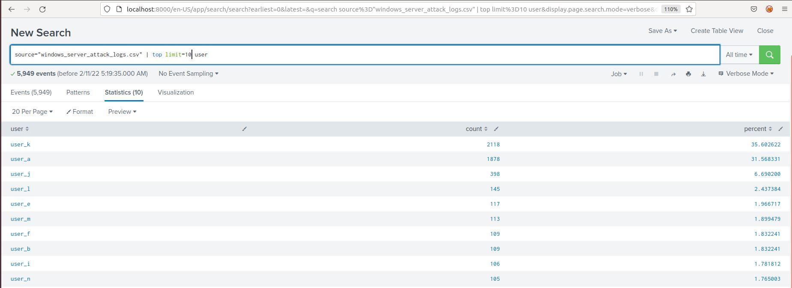
- Based on the attack signatures, what mitigations would you recommend to protect each user account? Provide global mitigations that the whole company can use and individual mitigations that are specific to each user.
  > 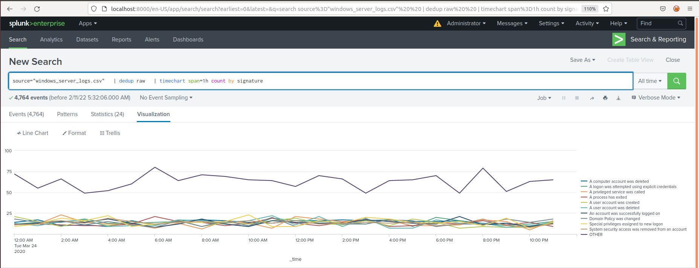
  > 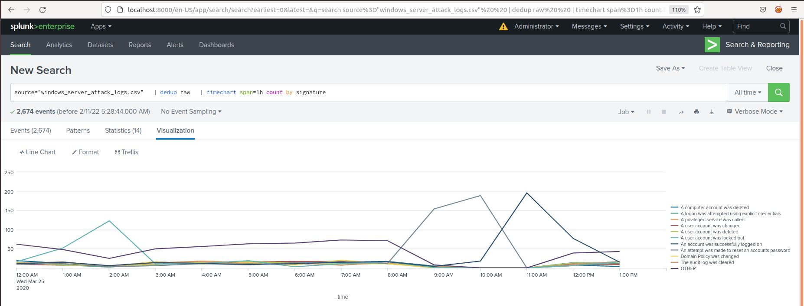
  
  > Answer: `Global` - Introducing a `2FA` or `MFA` process into the log in process would greatly reduce the success of the threat actor seen in this log. 

  > > - Answer: `user_j` - `An account was successfully logged on`
  > 
  > 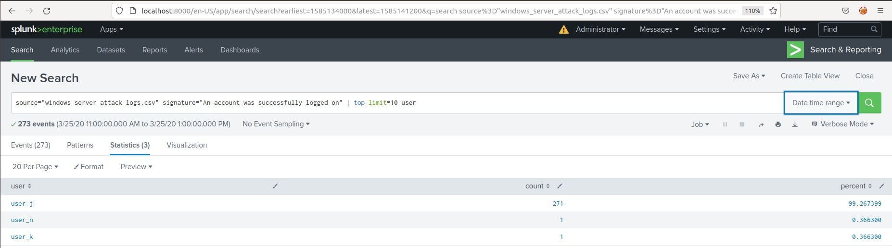
  > > - The log above shows that the attacker was able to successfully log in to `user_j` repeatedly.
  > > - First thing to do here would be to change the password for `user_j`. Next you could set up user-specific alerts to monitor continued activity on this user. 
  > 
  > 
  >  > - Answer: `user_a` - `A user account was locked out`
  > 
  > 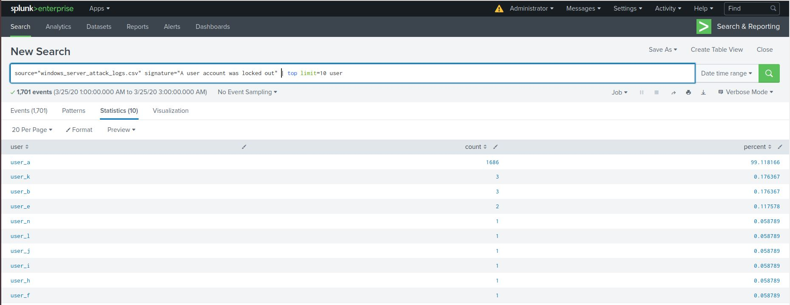
  > > - The log above shows that there was a `brute force` attack on `user_a`'s password.
  > > - `user_a` should change their password promptly. They need to make sure there is enough length and complexity to ensure the length of time needed to brute force the account high. 
  > 
  > > -  Answer: `user_k` - `An attempt was made to reset an accounts password`
  > 
  > 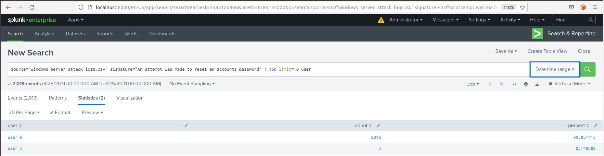
  > > - Here the logs show that the attacker knew `user_k`'s username or email credentials to log in. There were many attempts to reset the password and gain access, however the logs don't show any success on the attackers part. 
  > > - Ideally you'd set user-specific alerts for `user_k` to monitor for types of activity like this in the future. 

#### Question 2
- VSI has insider information that JobeCorp attempted to target users by sending "Bad Logins" to lock out every user.
- What sort of mitigation could you use to protect against this?
  > Answer: Depending on how the systems are being managed, you could set a group policy to lock out the accounts after a certain number of failed attempts. This would stop the continued use of force on any specific user while the timer is running. This would also allow the security analyst time to determine the users being affected by the "Bad Logins", and see which IP's are committing the offense. 
  
---
### Part 2: Apache Webserver Attack:

#### Question 1
- Based on the geographic map, recommend a firewall rule that the networking team should implement.
- Provide a "plain english" description of the rule.
- Provide a screen shot of the geographic map that justifies why you created this rule. 
  > Answer: After filtering out the traffic from the `United States`, the country which had the most activity coming from it was `Ukraine`. 
  > 
  > 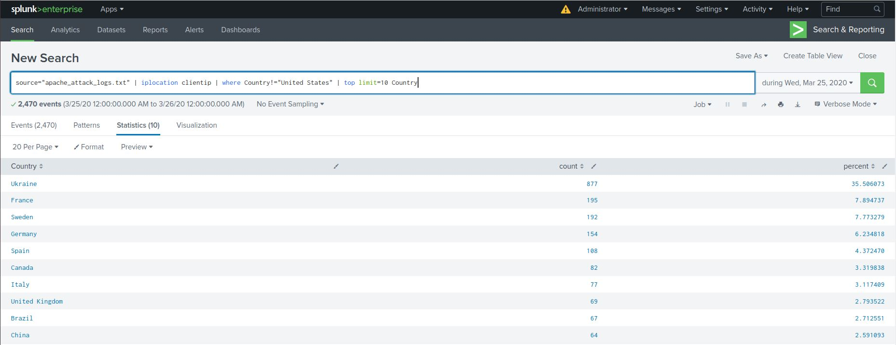
  > 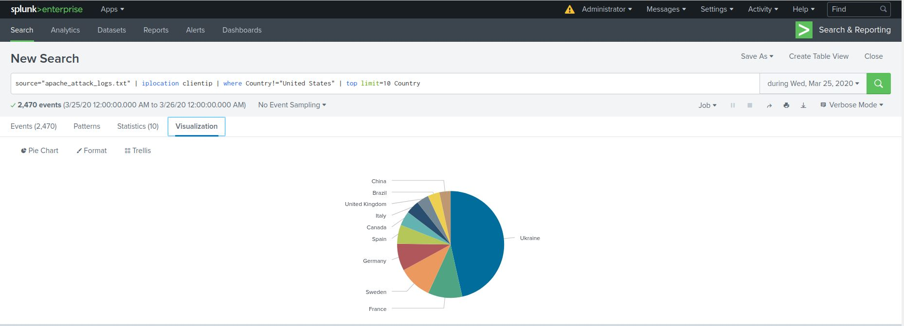
  > 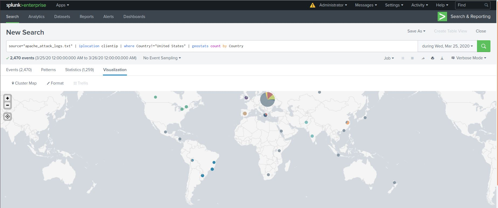
  > **_Firewall Rule:_** `Block all incoming HTTP traffic where the source IP comes from the country of Ukraine`.
  
#### Question 2

- VSI has insider information that JobeCorp will launch the same webserver attack but use a different IP each time in order to avoid being stopped by the rule you just created.

- What other rules can you create to protect VSI from attacks against your webserver?
  - Conceive of two more rules in "plain english". 

> Most of the data coming from `Ukraine` points to approximately `34%-35%` of the network traffic coming in. There were `3` notable pieces of information that could be used to create firewall rules including: `bytes`, `ip`, and `useragent`.
> 
> 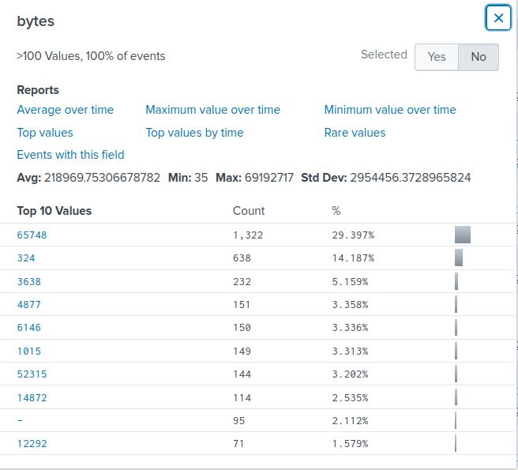
> 
> Answer: `29.4%` of all network traffic contained a value of `65748 bytes`. 
> **_Firewall Rule:_** `Block all incoming HTTP traffic where the bytes are equal to 65748`.

---

> 
> 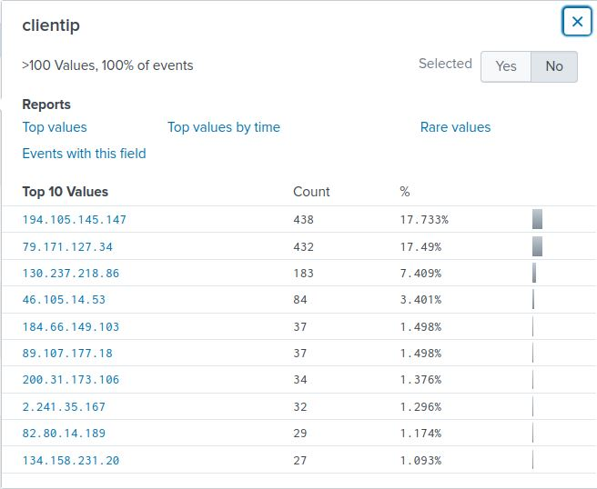
> 
> Answer: `17.7%` and  `17.5%` of the traffic came from the IPv4 address's of `194.105.145.147`, and `79.171.127.34` respectively.
> **_Firewall Rule:_** `Block all incoming HTTP traffic where the ip address is equal to 194.105.145.147 AND 79.171.127.34`.

---

> 
> 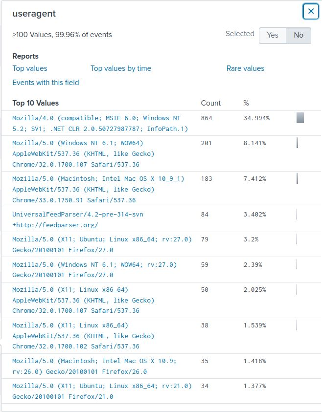
> 
> Answer: `34.9` of all network traffic came from the `useragent` `Mozilla/4.0 (compatible; MSIE 6.0; Windows NT 5.2; SV1; .NET CLR 2.0 50727987787; InfoPath.1)`. 
> **_Firewall Rule:_** `Block all incoming HTTP traffic where the useragent is equal to Mozilla/4.0 (compatible; MSIE 6.0; Windows NT 5.2; SV1; .NET CLR 2.0 50727987787; InfoPath.1).`
  
---

© 2020 Trilogy Education Services, a 2U, Inc. brand. All Rights Reserved.
